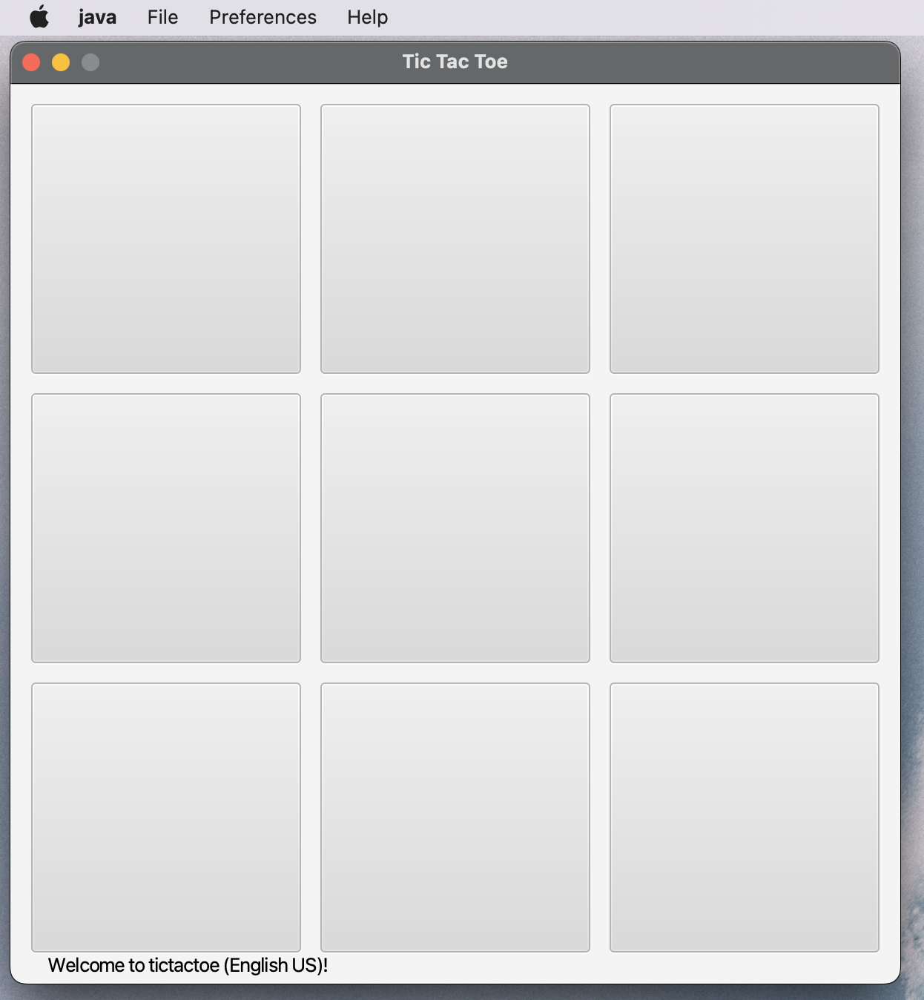
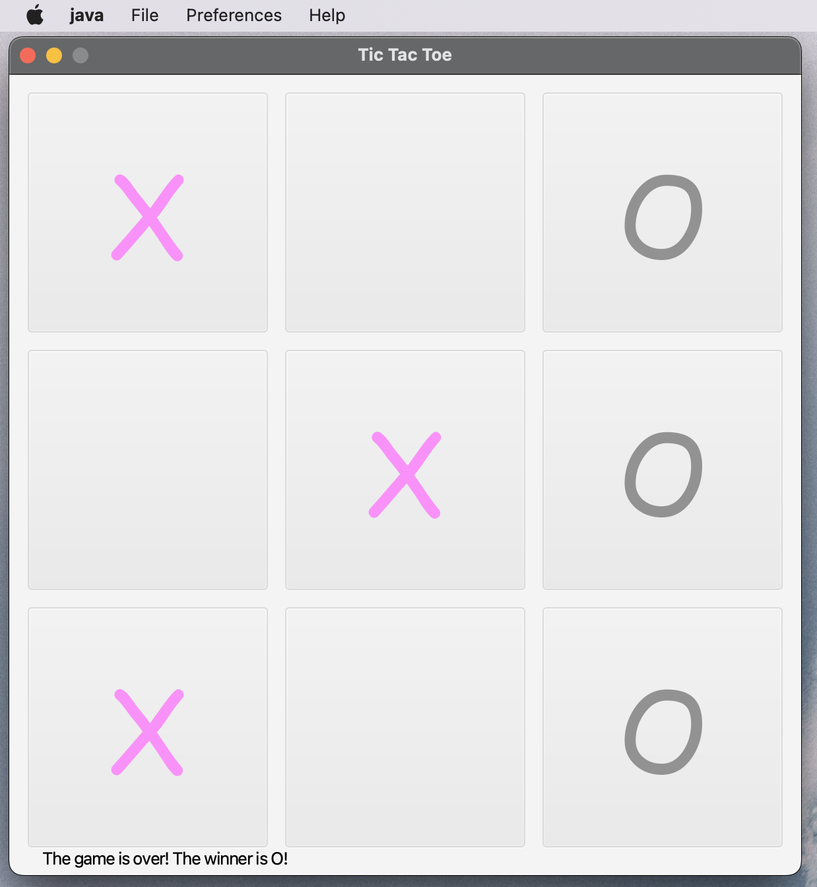
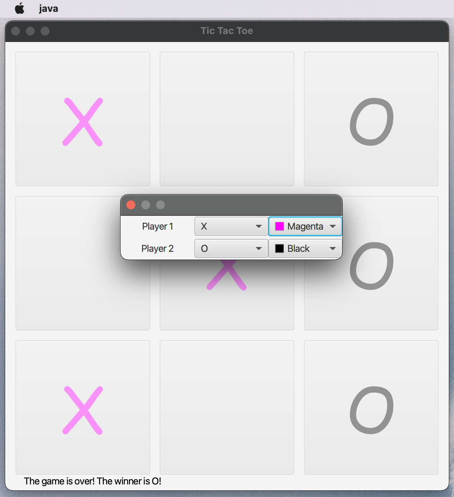
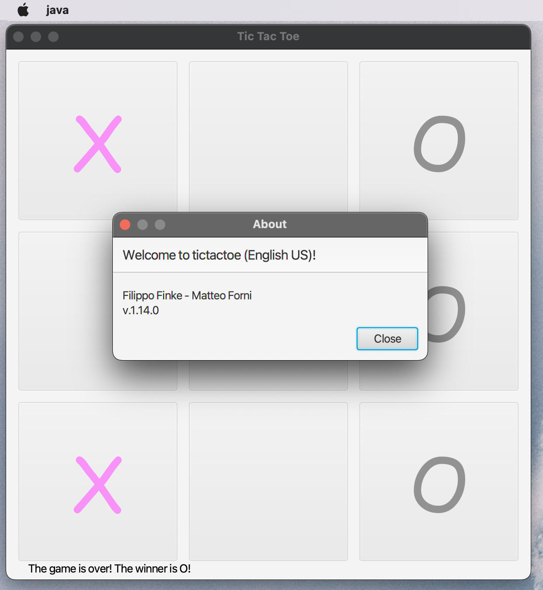

<h1 align="center">Welcome to TicTacToe 👋</h1>

> The TicTacToe game implemented in Java and JavaFX was a requirement for the Software Engineering class at SUPSI (University of Applied Sciences and Arts of Southern Switzerland). This project aimed to provide students with practical experience in utilizing design patterns and applying software engineering principles.

### 🏠 [Homepage](https://github.com/filippofinke/tictactoe)

## Screenshots

<details>
  <summary>Click me</summary>






</details>

## Motivation

<details>
  <summary>Click me</summary>
The motivation behind developing the TicTacToe game implemented in Java and JavaFX was to provide students with practical experience in various aspects of software engineering. The project was undertaken as a requirement for the Software Engineering class at SUPSI (University of Applied Sciences and Arts of Southern Switzerland).

The primary goal of the project was to familiarize students with working in a collaborative environment. By working together on this project, the students gained valuable experience in coordinating their efforts, dividing tasks, and integrating their individual contributions into a cohesive whole.

Another important aspect of the project was to apply an engineering approach to software development. This involved following best practices, such as using design patterns to design and implement the game. By utilizing design patterns, the students were able to create a well-structured and maintainable codebase.

The project also emphasized the use of versioning platforms, with Git being the chosen tool. Students learned how to effectively use Git for version control, enabling them to collaborate efficiently, track changes, and manage code versions throughout the development process.

The focus on user interface (UI) and user experience (UX) was another key aspect of the project. The students aimed to create an intuitive and visually appealing interface for the TicTacToe game. By considering UI/UX principles, they aimed to provide a seamless and enjoyable experience for the users.

Integration with the operating system (OS) was another important goal. The students worked on ensuring that the game seamlessly integrated with various operating systems, including Windows, Linux, and macOS. This involved addressing OS-specific considerations and leveraging platform-specific features when appropriate.

Overall, the TicTacToe project provided students with a comprehensive experience in developing software. It allowed them to apply engineering principles, utilize design patterns, collaborate effectively, use versioning platforms, focus on UI/UX, and integrate the application with the OS. Through this project, the students gained valuable insights and practical skills that will benefit them in their future software engineering endeavors.

</details>

## Features

- [x] Save and load games
- [x] Change symbols
- [x] Change colors
- [x] Change language
- [x] Change save location
- [x] Shortcuts for all actions
- [x] Integration with the OS (Windows, Linux, macOS)
- [x] Play against the computer
- [x] Feedback for the user
- [x] Persistent settings

## Prerequisites

- Java 17
- JavaFX 17
- Maven
- Git

## Clone

```sh
git clone https://github.com/filippofinke/tictactoe
```

## Install

Install the backend library

```sh
cd backed && mvn clean install
```

Create the jar file

```sh
cd frontend && mvn clean package
```

## Usage

```sh
java -jar target/frontend-*-jar-with-dependencies.jar
```

## Authors

👤 **Filippo Finke**

- Website: https://filippofinke.ch
- Github: [@filippofinke](https://github.com/filippofinke)
- LinkedIn: [@filippofinke](https://linkedin.com/in/filippofinke)

👤 **Matteo Forni**

- Github: [@matteoforni](https://github.com/matteoforni)
- LinkedIn: [@matteo-forni-bb0a93169](https://linkedin.com/in/matteo-forni-bb0a93169)

## Show your support

Give a ⭐️ if this project helped you!

<a href="https://www.buymeacoffee.com/filippofinke">
  
</a>

## 📝 License

Copyright © 2023 [Filippo Finke](https://github.com/filippofinke).<br />
Copyright © 2023 [Matteo Forni](https://github.com/matteoforni).<br />
